# 📊 Stock Predictor - Visual Architecture & Diagrams

## System Architecture Diagram

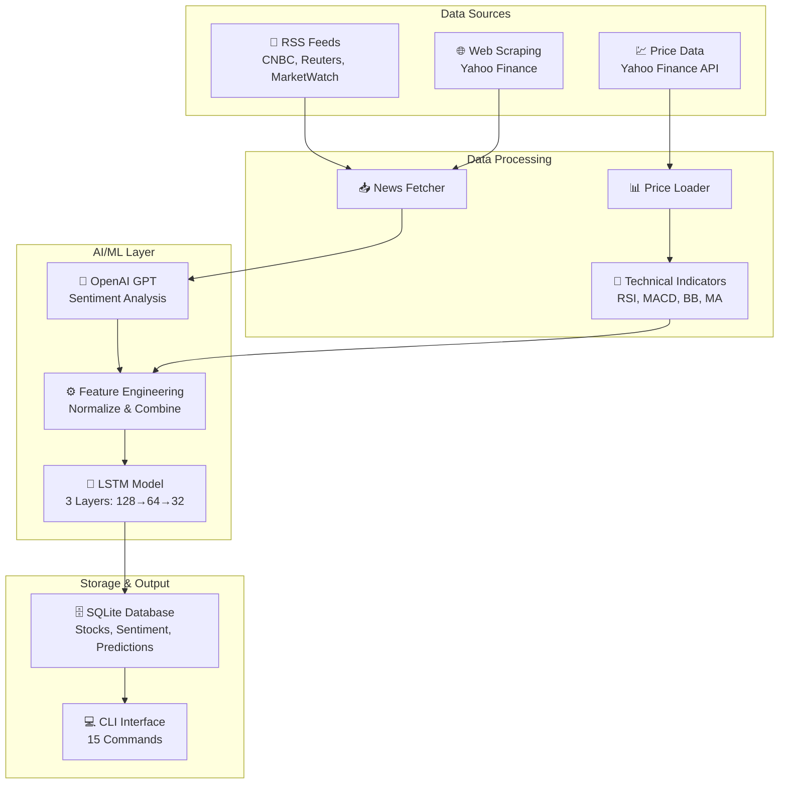

---

## Data Flow Pipeline

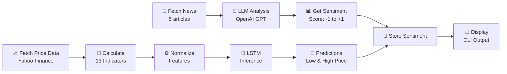

---

## Complete Workflow (Minute by Minute)

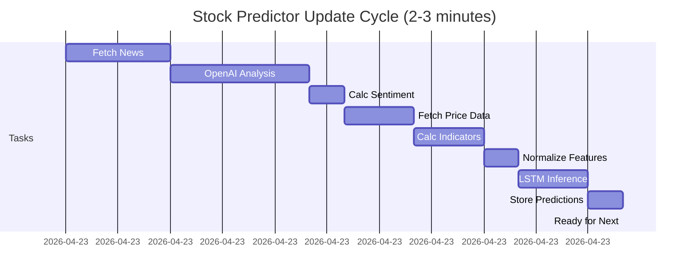

---

## LSTM Model Architecture

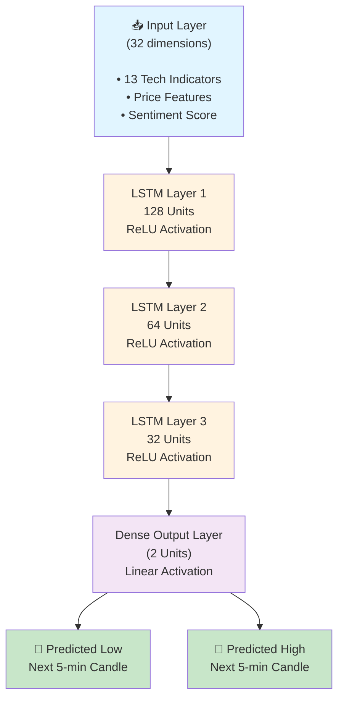

---

## Feature Vector Composition

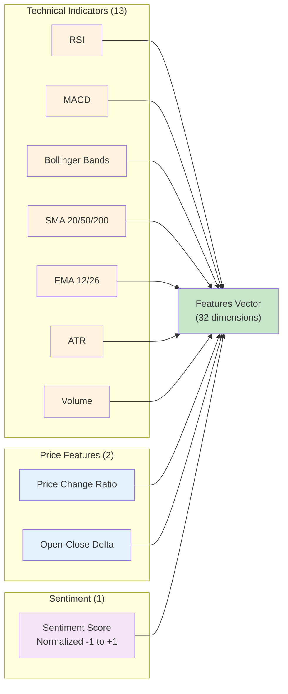

---

## Sentiment Analysis Flow

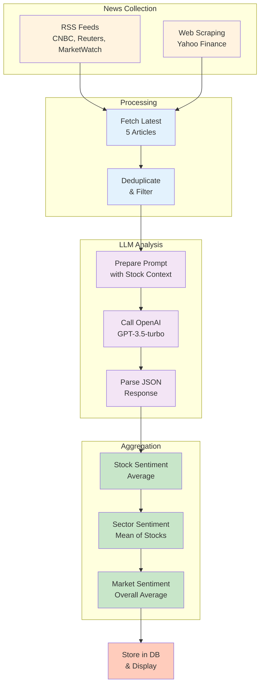

---

## Database Schema Relationships

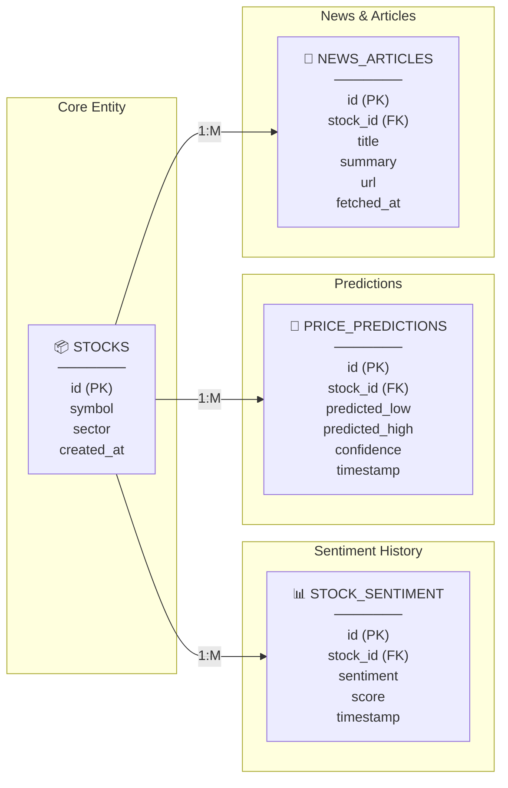

---

## Command Hierarchy

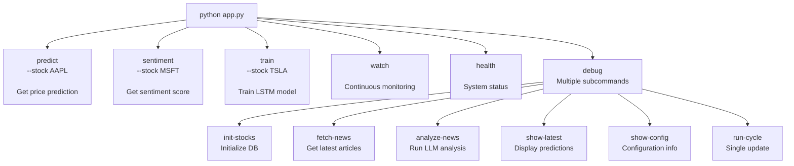

---

## Indicator Calculation Timeline

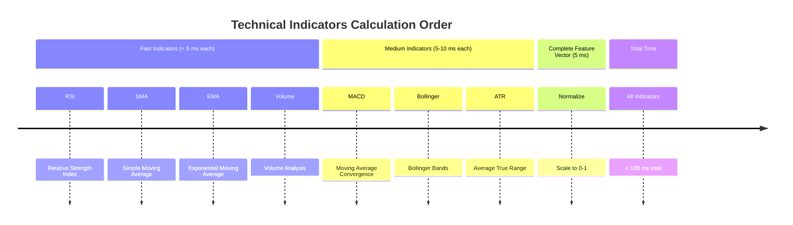

---

## Sentiment Score Interpretation

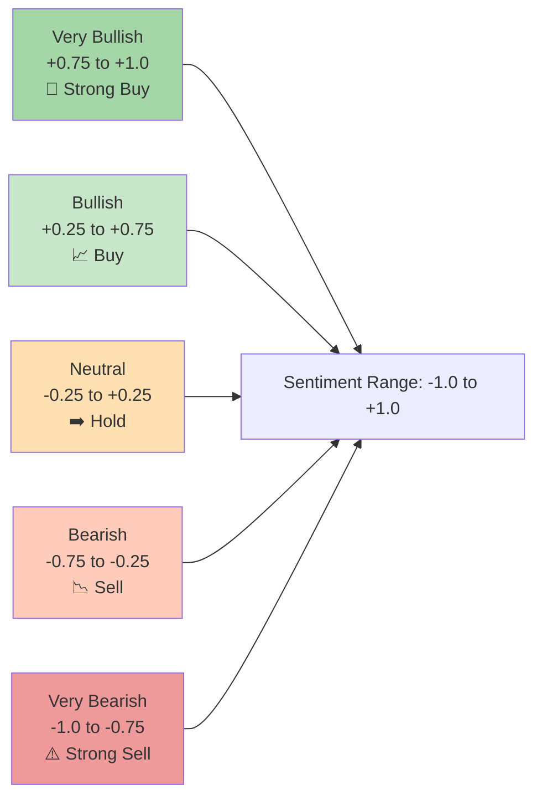

---

## Model Training Process

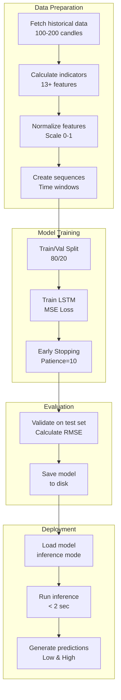

---

## Error Handling & Recovery

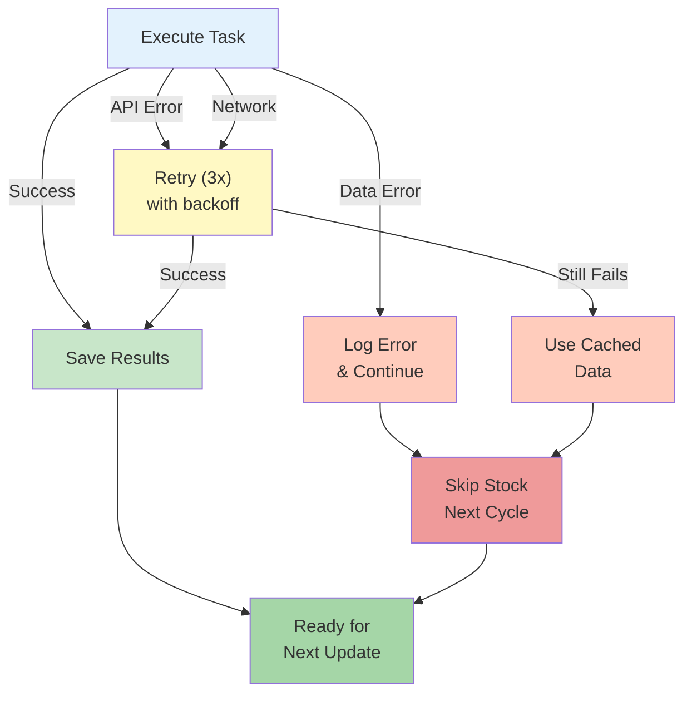

---

## Performance Metrics Dashboard

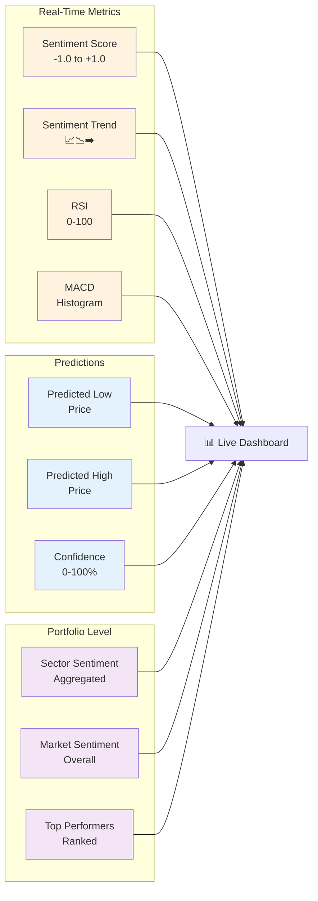

---

## Integration Points

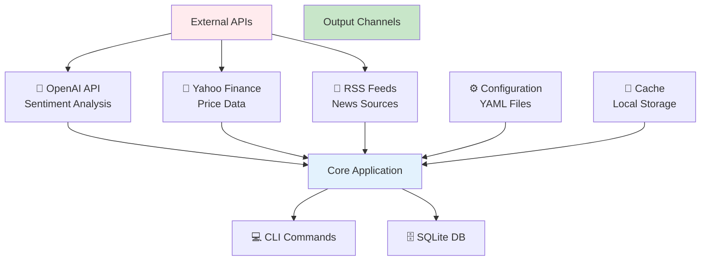

---

## Deployment Architecture

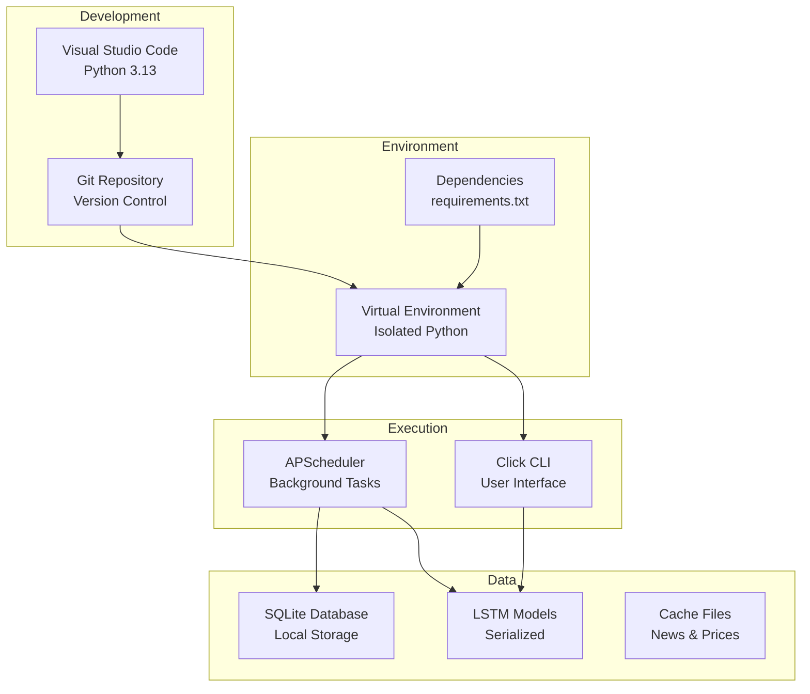

---

## Key Success Factors

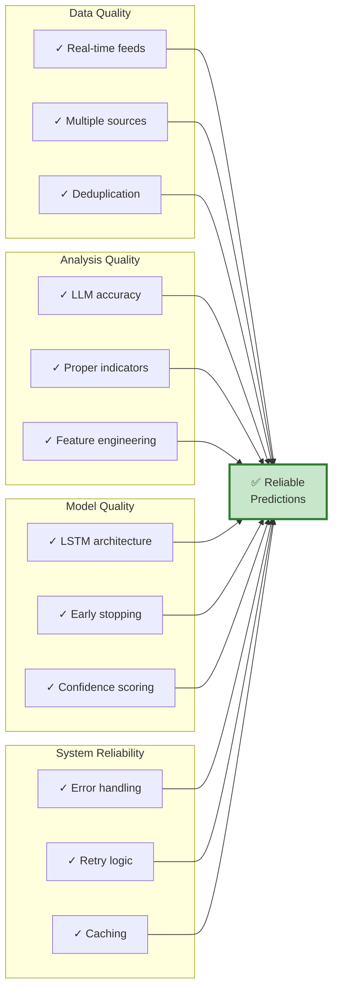

---

## Next Steps & Roadmap

```mermaid
timeline
    title Project Roadmap
    section Phase 1: Current
        Version 1.0 : ✅ Complete
        : • Core sentiment analysis
        : • Technical indicators
        : • LSTM model
        : • SQLite storage
        : • CLI interface
    
    section Phase 2: Planned
        Q3 2026 : 🔄 In Progress
        : • Crypto support
        : • WebSocket feeds
        : • Ensemble models
        : • API endpoint
    
    section Phase 3: Future
        Q4 2026 : 📋 Planned
        : • Automated trading
        : • Portfolio optimization
        : • Risk management
        : • Cloud deployment
    
    section Phase 4: Vision
        2027+ : 🌟 Long-term
        : • Multi-language NLP
        : • Reinforcement learning
        : • Social sentiment
        : • Real-time execution
```

---

*These diagrams provide a visual understanding of the Stock Predictor system architecture and data flows.*

