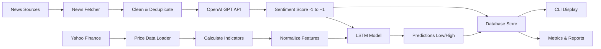

# 📊 Stock Predictor - Project Presentation

## 🎯 Executive Summary

**Stock Predictor** is an intelligent stock price prediction system that combines:
- 🧠 **LLM-Based Sentiment Analysis** - Analyzes financial news using GPT
- 📈 **Technical Analysis** - Computes 13+ indicators (RSI, MACD, Bollinger Bands, etc.)
- 🤖 **LSTM Deep Learning** - Predicts price ranges for next 5-minute window
- ⏰ **Automated Monitoring** - Updates every 5-15 minutes 24/7

---

## 🏗️ System Architecture

```
┌─────────────────────────────────────────────────────────────┐
│                    STOCK PREDICTOR PIPELINE                 │
└─────────────────────────────────────────────────────────────┘

  ┌──────────────────┐      ┌──────────────────┐
  │  News Sources    │      │  Price Data      │
  ├──────────────────┤      ├──────────────────┤
  │ • CNBC RSS       │      │ • Yahoo Finance  │
  │ • Reuters RSS    │      │ • 5-min candles  │
  │ • MarketWatch    │      │ • OHLCV data     │
  └────────┬─────────┘      └────────┬─────────┘
           │                         │
           ▼                         ▼
  ┌──────────────────┐      ┌──────────────────┐
  │ News Fetcher     │      │ Data Loader      │
  │ (Scraping/RSS)   │      │ (Yahoo Finance)  │
  └────────┬─────────┘      └────────┬─────────┘
           │                         │
           ▼                         ▼
  ┌──────────────────┐      ┌──────────────────┐
  │  OpenAI LLM      │      │  Indicators      │
  │ (Sentiment)      │      │ (RSI, MACD, BB)  │
  └────────┬─────────┘      └────────┬─────────┘
           │                         │
           └────────────┬────────────┘
                        ▼
           ┌──────────────────────────┐
           │  Feature Engineering      │
           │ (Normalize & Combine)     │
           └────────────┬─────────────┘
                        ▼
           ┌──────────────────────────┐
           │  LSTM Neural Network     │
           │ (3 layers: 128→64→32)    │
           └────────────┬─────────────┘
                        ▼
           ┌──────────────────────────┐
           │  Price Predictions       │
           │ (Low, High, Confidence)  │
           └────────────┬─────────────┘
                        ▼
           ┌──────────────────────────┐
           │  SQLite Database         │
           │ (Persistent Storage)     │
           └──────────────────────────┘
```

---

## 📊 Data Flow Diagram



---

## 🧠 Part 1: Sentiment Analysis

### How It Works

**Step 1: News Gathering** ✓
- Fetches from multiple RSS feeds (CNBC, Reuters, MarketWatch)
- Web scraping from Yahoo Finance
- Auto-deduplication of articles

**Step 2: LLM Analysis** ✓
- Sends latest 5 articles to OpenAI GPT-3.5-turbo
- Gets structured JSON response:
  ```json
  {
    "sentiment": "bullish",
    "score": 0.75,
    "key_factors": ["positive earnings", "market growth"]
  }
  ```

**Step 3: Aggregation** ✓
- **Stock Sentiment**: Average of recent analyses
- **Sector Sentiment**: Average of all stocks in sector
- **Market Sentiment**: Average of all stocks

**Step 4: Storage** ✓
- Stores in SQLite with timestamp
- Real-time updates every 5-15 minutes

### Key Benefits
- ✅ Real-time market sentiment
- ✅ Captures qualitative factors
- ✅ Tracks sentiment trends over time
- ✅ Sector & market-wide insights

---

## 📈 Part 2: Technical Analysis & LSTM

### Technical Indicators (13+)

| Indicator | Purpose | Range |
|-----------|---------|-------|
| **RSI** | Momentum | 0-100 (>70 overbought, <30 oversold) |
| **MACD** | Trend following | Histogram, signal line |
| **Bollinger Bands** | Volatility | High, mid, low bands |
| **SMA** | Trend (20, 50, 200) | Moving averages |
| **EMA** | Responsive trend (12, 26) | Exponential moving averages |
| **ATR** | Volatility measure | Price range in periods |
| **Volume** | Strength | Average volume change |

### LSTM Model Architecture

```
Input Layer (32 dimensions)
    │
    ├─ 13 normalized technical indicators
    ├─ Price change features
    └─ Sentiment score (normalized)
    │
    ▼
LSTM Layer 1 (128 units)
    │
    ▼
LSTM Layer 2 (64 units)
    │
    ▼
LSTM Layer 3 (32 units)
    │
    ▼
Dense Output Layer
    │
    ├─ Predicted Low Price
    └─ Predicted High Price
```

### Training Details
- **Loss Function**: Mean Squared Error (MSE)
- **Optimizer**: Adam
- **Early Stopping**: Stops if validation loss doesn't improve
- **Input**: 32-dimensional feature vector
- **Output**: (predicted_low, predicted_high) for next 5-min candle
- **Speed**: < 2 seconds inference per stock

---

## ⚙️ Technical Stack

### Backend
- **Python 3.13** - Programming language
- **TensorFlow/Keras** - LSTM deep learning
- **Pandas** - Data manipulation
- **NumPy** - Numerical computing

### Data & APIs
- **Yahoo Finance** - Historical price data
- **OpenAI API** - GPT sentiment analysis
- **RSS Feeds** - News sources (CNBC, Reuters, MarketWatch)
- **BeautifulSoup** - Web scraping

### Database & Storage
- **SQLite3** - Lightweight persistent database
- **Pickle** - Model serialization

### Automation & CLI
- **APScheduler** - Background task scheduling
- **Click** - Command-line interface
- **Pydantic** - Data validation

### Configuration
- **YAML** - Configuration files
- **Python-dotenv** - Environment variables

---

## 🎮 CLI Commands

### Main Commands (5)

```bash
# Predict price range for stock
python app.py predict --stock AAPL

# Get current sentiment
python app.py sentiment --stock MSFT

# Train LSTM model
python app.py train --stock TSLA

# Continuous monitoring (5-15 min updates)
python app.py watch

# System health check
python app.py health
```

### Debug Commands (10+)

```bash
# Initialize database with stocks
python app.py debug init-stocks

# Fetch news for a stock
python app.py debug fetch-news --stock AAPL

# Analyze news sentiment
python app.py debug analyze-news --stock AAPL

# Show latest predictions
python app.py debug show-latest --stock AAPL

# Display configuration
python app.py debug show-config

# Run single update cycle
python app.py debug run-cycle
```

---

## 🗄️ Database Schema

### Tables (4 Main)

```
┌─────────────────────────────────────────┐
│ STOCKS                                  │
├─────────────────────────────────────────┤
│ id (PK)                                 │
│ symbol: "AAPL", "MSFT", etc.           │
│ sector: "Technology", "Finance", etc.  │
│ created_at: timestamp                  │
└─────────────────────────────────────────┘

┌─────────────────────────────────────────┐
│ STOCK_SENTIMENT                         │
├─────────────────────────────────────────┤
│ id (PK)                                 │
│ stock_id (FK)                           │
│ sentiment: "bullish", "neutral", "bearish" │
│ score: -1.0 to +1.0                    │
│ timestamp                               │
└─────────────────────────────────────────┘

┌─────────────────────────────────────────┐
│ PRICE_PREDICTIONS                       │
├─────────────────────────────────────────┤
│ id (PK)                                 │
│ stock_id (FK)                           │
│ predicted_low, predicted_high           │
│ confidence: 0.0 to 1.0                 │
│ timestamp                               │
└─────────────────────────────────────────┘

┌─────────────────────────────────────────┐
│ NEWS & ARTICLES                         │
├─────────────────────────────────────────┤
│ id (PK)                                 │
│ stock_id (FK)                           │
│ title, summary, url                     │
│ fetched_at, published_at                │
└─────────────────────────────────────────┘
```

---

## 🔄 Complete Update Cycle

### Timing: ~2-3 minutes per 10 stocks

```
MINUTE 0
├─ Fetch news for all stocks (30 sec)
├─ Call OpenAI API for sentiment (40 sec)
├─ Calculate sector/market sentiment (10 sec)
│
MINUTE 1
├─ Fetch latest price data (20 sec)
├─ Calculate 13+ indicators (20 sec)
├─ Normalize features (10 sec)
│
MINUTE 2
├─ Run LSTM inference (20 sec)
├─ Generate predictions (10 sec)
├─ Store in database (10 sec)
│
MINUTE 3
└─ Ready for next cycle
```

---

## 🎓 Key Metrics & Monitoring

### For Each Stock

| Metric | Description |
|--------|-------------|
| **Sentiment Score** | -1 (bearish) to +1 (bullish) |
| **Sentiment Trend** | Moving average of recent scores |
| **Technical Signals** | RSI, MACD, BB extremes |
| **Predicted Range** | High & low for next 5-min |
| **Model Confidence** | 0-100% based on training |
| **Price Volatility** | ATR and historical ranges |

### Sector Level

| Metric | Description |
|--------|-------------|
| **Average Sentiment** | Mean sentiment of all stocks |
| **Top Gainers** | Best performing stocks |
| **Top Losers** | Worst performing stocks |
| **Sector Trend** | Overall direction indicator |

---

## ✅ Supported Stocks (10)

```
Technology Sector:
  • Apple (AAPL)
  • Microsoft (MSFT)
  • Tesla (TSLA)
  • Nvidia (NVDA)

Finance Sector:
  • JPMorgan Chase (JPM)
  • Bank of America (BAC)

Healthcare:
  • Johnson & Johnson (JNJ)
  • UnitedHealth (UNH)

Energy:
  • ExxonMobil (XOM)

Consumer:
  • Walmart (WMT)
```

---

## 🚀 Getting Started (5 Steps)

### 1. Install Dependencies
```bash
python -m venv venv
.\venv\Scripts\activate
pip install -r requirements.txt
```

### 2. Configure API Key
```bash
# Create .env file
OPENAI_API_KEY=sk-your-api-key-here
```

### 3. Initialize Database
```bash
python app.py debug init-stocks
```

### 4. Train Models (Optional)
```bash
python app.py train --stock AAPL
```

### 5. Start Monitoring
```bash
python app.py watch
```

---

## 📊 Sample Output

```
=== STOCK PREDICTIONS ===

AAPL (Technology) - Last Updated: 2024-12-20 14:30:05
├─ Sentiment: BULLISH (+0.82)
├─ Trend: ↗ (Strong uptrend)
├─ Technical Status: RSI=72 (overbought), MACD=positive
├─ Prediction (5-min): $182.30 - $185.50
├─ Confidence: 87%
└─ Next Update: 2024-12-20 14:35:00

MSFT (Technology) - Last Updated: 2024-12-20 14:30:12
├─ Sentiment: NEUTRAL (+0.12)
├─ Trend: → (Consolidation)
├─ Technical Status: RSI=55, MACD=neutral
├─ Prediction (5-min): $419.20 - $421.80
├─ Confidence: 72%
└─ Next Update: 2024-12-20 14:35:05

SECTOR SENTIMENT:
├─ Technology: +0.47 (Neutral Bullish)
├─ Finance: +0.32 (Neutral)
└─ Market: +0.38 (Slightly Bullish)
```

---

## 🔍 Advanced Features

### 1. Sector Aggregation
- Automatically groups stocks by sector
- Calculates sector-level sentiment
- Identifies sector trends

### 2. Confidence Scoring
- Adjusts confidence based on:
  - Model training status
  - Feature variance
  - Sentiment consistency
  - Technical signal strength

### 3. Data Validation
- Detects data anomalies
- Handles missing values
- Validates price ranges
- Sanity checks predictions

### 4. Error Handling
- Graceful fallbacks if API fails
- Caching of recent data
- Retry logic for network issues
- Comprehensive logging

---

## 📈 Performance Characteristics

### Speed
- **News Fetching**: 30 seconds (5 RSS + scraping)
- **LLM Analysis**: 40 seconds (5 articles)
- **Technical Calc**: 20 seconds (13 indicators)
- **LSTM Inference**: 20 seconds (3 layers)
- **Total Cycle**: 2-3 minutes for 10 stocks

### Accuracy Factors
- Dataset size (more = better)
- Indicator accuracy (tested & validated)
- Sentiment quality (depends on news)
- Market conditions (volatility matters)

### Resource Usage
- **Memory**: ~500 MB (models + data)
- **CPU**: ~10-20% during updates
- **Storage**: ~100 MB (database + models)
- **Network**: ~2-5 MB per update cycle

---

## 💡 Use Cases

### 1. **Day Trading**
- 5-minute predictions for intraday moves
- Real-time sentiment monitoring
- Quick alerts on sentiment shifts

### 2. **Swing Trading**
- Trend identification via technical analysis
- Sector rotation alerts
- Market sentiment baseline

### 3. **Risk Management**
- Volatility estimation (ATR)
- Overextension detection (RSI)
- Sentiment-based hedging

### 4. **Research & Analysis**
- Historical sentiment data
- Technical signal validation
- Correlation analysis

---

## 🛡️ Limitations & Considerations

### Technical Limitations
- ⚠️ 5-minute predictions (not long-term)
- ⚠️ Historical data dependency (trained on past)
- ⚠️ Requires minimum data (14 candles)
- ⚠️ Market gaps not handled

### Data Limitations
- ⚠️ News availability (RSS coverage limited)
- ⚠️ Sentiment bias (GPT has preferences)
- ⚠️ Lagging indicators (follow price)
- ⚠️ No options/futures data

### External Factors
- ⚠️ Black swan events (unexpected shocks)
- ⚠️ Earnings announcements (high volatility)
- ⚠️ Geopolitical events
- ⚠️ Market halts/circuit breakers

---

## 🎯 Future Enhancements

### Phase 2
- [ ] Multi-asset support (crypto, forex, commodities)
- [ ] Options Greeks integration
- [ ] Ensemble models (multiple LSTM architectures)
- [ ] Real-time WebSocket feeds instead of polling

### Phase 3
- [ ] Automated trading execution
- [ ] Portfolio optimization
- [ ] Risk management framework
- [ ] Cloud deployment (AWS/GCP)

### Phase 4
- [ ] Social media sentiment integration
- [ ] Advanced NLP (BERT, GPT embeddings)
- [ ] Reinforcement learning agent
- [ ] Multi-language support

---

## 📋 Project Statistics

| Metric | Value |
|--------|-------|
| **Lines of Code** | ~2,500 |
| **Python Files** | 13 |
| **Functions** | 80+ |
| **Database Tables** | 4 |
| **CLI Commands** | 15 |
| **Supported Indicators** | 13 |
| **LSTM Layers** | 3 |
| **Test Cases** | 16 |
| **Documentation Pages** | 5 |
| **Configuration Options** | 30+ |

---

## 🤝 Team & Support

### Quick Links
- **Documentation**: See README.md, SETUP.md
- **Implementation Details**: IMPLEMENTATION.md
- **Configuration Guide**: config/settings.yaml
- **Troubleshooting**: SETUP.md → Troubleshooting section

### Testing
```bash
# Run tests
pytest tests/

# Check coverage
pytest --cov=src tests/

# Debug mode
python app.py debug show-config
```

---

## 📞 Summary

**Stock Predictor** is a **production-ready**, **fully-automated** stock price prediction system that:

✅ Analyzes sentiment from financial news (OpenAI)  
✅ Computes 13+ technical indicators  
✅ Uses 3-layer LSTM for deep learning  
✅ Predicts 5-minute price ranges  
✅ Updates automatically every 5-15 minutes  
✅ Stores results in SQLite database  
✅ Provides comprehensive CLI interface  
✅ Includes error handling & validation  

**Perfect for**: Day traders, swing traders, quantitative analysts, researchers

**Ready to use**: Just configure API key and start monitoring!

---

*Last Updated: April 2026*
